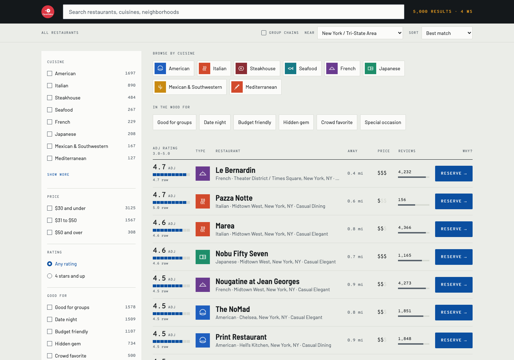
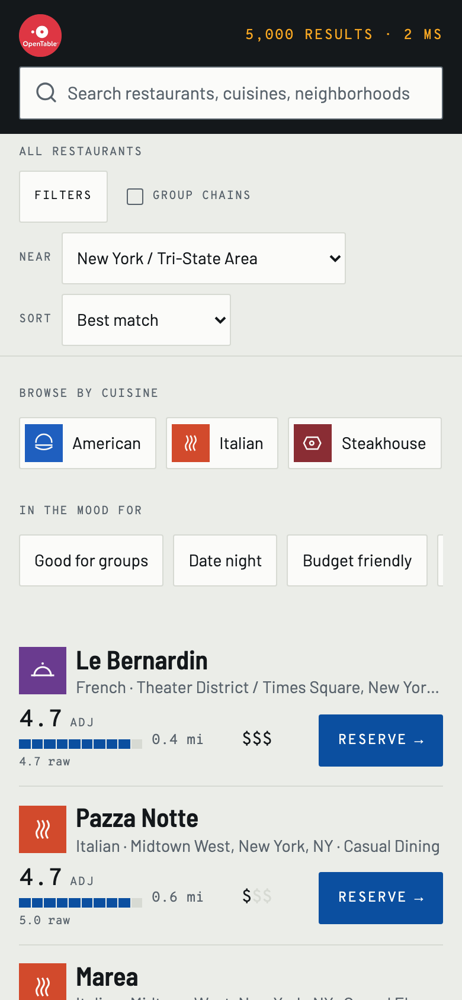

# OpenTable — restaurant search and discovery on Algolia

A working search-and-discovery prototype for a simulated prospect, OpenTable. Two messy source files
become 5,000 Algolia records; the index configuration was measured rather than assumed; and a React
InstantSearch front end serves the two diners in the discovery notes — the one who knows the
restaurant name and cannot spell it, and the one who does not know what they want yet.

**Live demo:** https://algolia-takehome-assessment.netlify.app/ · **Repo:** <https://github.com/kcloud99/algolia-take-home>





*The arrival state, and the same index at 390px: the entry restacks with the score joining its last
reading line, the facet rail becomes a bottom sheet, and no label or control falls under 44px. Zero
horizontal overflow, measured at 390 / 430 / 680 / 768 / 1024 / 1280 / 1440px.*

---

## Run it

Node 22+, and an Algolia account on the free Build plan (5,000 records against a 1M limit).

```bash
npm install
cp .env.example .env      # app ID, admin key for scripts/, search-only key for the browser

npm run data:build        # join + clean + derive → data/out/records.json   (needs no keys)
npm run index:config      # settings, replicas, synonyms, rules — all as code
npm run index:push        # replaceAllObjects, 5,000 records
npm run dev               # http://localhost:5173
```

Verified from a clean clone on Node 22.13: `npm ci`, then `data:build` reproduces the committed
`data/out/records.json` **byte-identically**, then `typecheck` and `build` both clean.
`npm run index:test -- tuned` re-runs the 27-query relevance manifest against the live index.

Only `VITE_`-prefixed variables reach the browser and the only key among them is search-only. The
admin key is used by `scripts/` and never bundled — checked rather than asserted: it appears **0
times** in `dist/assets/*.js`, and the frontend uses `liteClient`, which has no write methods at all.

---

## The five decisions I would lead with

Nothing below was tuned on faith. The baseline was captured against Algolia's default settings
*before* anything was configured, both runs are committed, and three settings from the original
design were reversed or removed once measured.

**1. Distance is bucketed, not measured — and this is the headline.**
Geo is the *second* criterion in Algolia's tie-breaking formula, so at its default metre-level
granularity it becomes a strict distance sort that silently disables everything below it, including
the custom ranking this pipeline exists to produce. Graduated `aroundPrecision` makes nearby
restaurants *tie* on distance so quality decides inside the bucket. Measured across seven
configurations in two markets: the empty query from New York moves from a 4.16 mean adjusted rating
(opening on a 4.2 with 126 reviews) to **4.56** (opening on Le Bernardin, 4.7 from 4,232 reviews),
while keeping every result within 1.4 km.
→ [`relevance-testing.md` § Geo](docs/relevance-testing.md#geo--tested-separately-and-the-measurement-changed-the-design)

**2. Ratings are Bayesian-smoothed, and rounded on purpose.**
4,435 of 5,000 restaurants (89%) sit in the four-star bucket, and 15 of the 21 perfect 5.0 scores
come from fewer than 20 reviews — so `desc(stars_count)` opens the page on 5.0s from two, three and
five reviews. Shrinkage toward the dataset mean fixes that; rounding it to one decimal is the part
worth explaining. `customRanking` only breaks ties, so near-unique values mean records never tie and
every signal below the first is dead code. 17 rating values then 38 popularity values: coarse first,
finer second.
→ [`data-decisions.md` § 3](docs/data-decisions.md#3-what-we-derived)

**3. Chains are derived from names, then collapsed with `distinct`.**
Exact-name matching says this dataset has almost no chains — 21 duplicate names, all in different
cities. Splitting names on a whitespace-padded dash reveals **158 brands across 604 restaurants, and
113 brands with two or more locations in one metro**, which is the third pain point in the discovery
notes. `attributeForDistinct: chain_name` plus `distinct` as a *query* parameter means one index
serves both diners — and because the surviving row is chosen by the full ranking formula, geo makes
it the *nearest* branch automatically. The autocomplete dropdown had the same pain and did **not**
have that fix: Autocomplete issues its own requests, so `<Configure>` never reached them and typing
`ruth` in New York offered Ruth's Chris in Honolulu. Found by driving the UI, not by reading it.
→ [`relevance-testing.md` § Chains](docs/relevance-testing.md#chains-in-one-metro--no-change-and-that-is-the-point)

**4. The relevance work is a record, not a claim.**
27 queries across twelve conditions — known-item, misspelled, concatenated, prefix, punctuation,
broad, ambiguous, location, chain-in-a-metro, intent, zero-result and empty — **written before a
single search result was observed**, so the configuration could not be tuned to flatter the test set.
Hard zero-results went from 6 of 27 to 1. More useful than the count: `mccormick and schmicks` was
returning 10 hits where the complete answer is 13, and narrowing the index dropped it to 0 before
`optionalWords` fixed it properly. A page that is quietly truncated is more dangerous than an empty
one, because nobody reports it.
→ [`relevance-testing.md`](docs/relevance-testing.md) · both runs committed with the settings that produced them

**5. Search is instrumented from day one.**
Insights `view`, `click` and `conversion` events, with `clickAnalytics` on to mint the `queryID` that
attributes a booking back to the query that produced it. That is the bridge to the outcome OpenTable
named — conversion from search into bookings — and it is a prerequisite rather than a reward: Dynamic
Re-Ranking, Personalization, Recommend and NeuralSearch all train on exactly these events. The client
is bundled rather than fetched from a CDN, so a live demo has no third-party runtime dependency; a
full session records **zero** third-party requests.

---

## What the data itself says

Findings from ingestion, worth raising with OpenTable regardless of the search project:

- **Every one of the 5,000 image URLs is dead** — all redirect to the same 2.2 KB placeholder. The
  interface draws a cuisine pictogram rather than substituting stock photography, because a
  photograph of somebody else's steak is the one thing on screen pretending to be data.
- **The two source files disagree** on price for 220 restaurants (4.4%) and on 95 phone numbers —
  different numbers, not formatting — and 50.6% of the JSON phone values are malformed anyway.
  Which system is the system of record is a discovery question, not an engineering one.
- **`neighborhood` is identical to `city` on exactly 2,500 records (50%)**, so a UI printing both
  renders "Plano, Plano". The field carries no information on half the catalogue.

Full table, with scale and business consequence: [`data-decisions.md` § 6](docs/data-decisions.md#6-data-quality-summary--for-the-customer).

---

## What is in the repo

| Path | What it holds |
|---|---|
| [`docs/approach.md`](docs/approach.md) | The narrative: pipeline, index, relevance method, UI thesis, trade-offs |
| [`docs/data-decisions.md`](docs/data-decisions.md) | The join, every cleanup, every derived field, every assumption |
| [`docs/relevance-testing.md`](docs/relevance-testing.md) | Before/after across 27 queries, what changed and why, what is still wrong |
| [`docs/relevance-baseline.md`](docs/relevance-baseline.md) · [`-tuned.md`](docs/relevance-tuned.md) | The two generated runs, each embedding the live settings behind it |
| [`docs/customer-questions.md`](docs/customer-questions.md) | Answers to the three support questions |
| [`docs/build-plan.md`](docs/build-plan.md) | The step ladder, written before the code and kept accurate |
| [`docs/kb/`](docs/kb/) | Working reference notes on Algolia, including the settings measurement overturned |
| [`scripts/`](scripts/) | Pipeline, index configuration, push, relevance harness — 19 files |
| [`app/`](app/) | Vite + React + TypeScript + Tailwind search experience — 39 files |
| [`data/raw/`](data/raw/) · [`data/out/`](data/out/) | Untouched source copies, and the generated records — both committed, so the index is reviewable |
| [`DESIGN.md`](DESIGN.md) · [`CLAUDE.md`](CLAUDE.md) | The design system, and the project context the work was directed from |
| [`netlify.toml`](netlify.toml) | The deploy as code — build command, publish directory, and the two environment-variable traps |

One index plus three virtual replicas. No backend, no Next.js, no auth, no state library, no monorepo
tooling — the scope of this problem does not require them, and unnecessary architecture is harder to
hand over than no architecture.

---

## Trade-offs I would rather volunteer than have found

- **`fogodechao` returns nothing.** Algolia splits a concatenated token into at most *two* words, so
  `meltingpot` and `ruthschris` resolve and three-word brands do not. The fix is one derived field,
  left out because the way to size a long-tail case is a query log rather than a guess.
- **`michelin` returns three restaurants** for a word in no field of any record — typo tolerance
  finds *Michelangelo*. Tightening typos enough to stop it would break `benihanna`, so the interface
  discloses it instead: *"nothing here is spelled 'michelin'."* The lesson belongs to the customer: a
  reported no-results rate understates the problem, because the engine papers over vocabulary gaps
  with near-matches.
- **Vibe tags are heuristics** — inferred from dining style, price, rating and review volume. No
  restaurant told us it was good for a date. In production they come from menu or review data.
- **Two Build-plan ceilings shaped the configuration**: three Rules per index (so date-night and
  special-occasion merged) and no `optionalFilters` in Rules (so the occasion rule filters where it
  should boost). Both noted in the source with the paid-plan version alongside.
- **The live map was cut**, early and deliberately: geo *ranking* is the valuable half and costs a
  `<Configure>` block, where a map is a whole surface. Recorded as a scope decision in
  [`build-plan.md`](docs/build-plan.md#phase-3--search-experience) rather than left as an omission.

More, in detail: [`relevance-testing.md` § What is still wrong](docs/relevance-testing.md#what-is-still-wrong)
and [`approach.md` § 9](docs/approach.md#9-limits-stated).

---

## Hours

**About 20 hours** across three days, reconstructed from the commit timestamps and a per-step build
log rather than estimated afterwards:

| | Hours |
|---|---|
| Reading the data, Algolia reference notes, writing the plan — before the first commit | ~4 |
| Data pipeline | ~3.5 |
| Index configuration and relevance testing | ~3.5 |
| Search experience | ~6.5 |
| Submission documents and deploy | ~2.5 |
| **Total** | **~20** |

That is above the 10–14 this project's own plan targeted, and the overage is all in one place:
measuring instead of trusting. Seven `aroundPrecision` configurations across two markets; three
designed settings applied both ways and diffed across all 27 queries; a UI whose every visual claim
was checked against a render, which is how nine defects were found — one of them shipping silently
for two steps. AI tooling was used throughout, which the exercise encourages; [`CLAUDE.md`](CLAUDE.md)
is committed as the record of how it was directed.

---

## What I would do next

1. **Query Suggestions**, once there are real searches behind it. Autocomplete currently federates
   restaurants, cuisines and cities — real facet values, which cannot go stale, but cannot learn.
2. **A/B testing and Dynamic Re-Ranking.** The events are already flowing, so this is the payoff:
   test the Bayesian `m` — the review count at which a restaurant's own rating outweighs the crowd's
   — against real conversion rather than against my judgement.
3. **Availability as a filter.** The largest relevance win available to OpenTable and not to this
   dataset: a restaurant with no table at 7pm tonight is not a relevant result, however good it is.
4. **OpenTable's own cuisine taxonomy** in place of the 23-group rollup here, which is editorial.
5. **Personalization** keyed on `authenticatedUserToken`, so it is per-diner rather than per-browser.
6. **Fix the data at source.** The dead images and the two-file disagreements are worth more to the
   business than any further relevance tuning.
